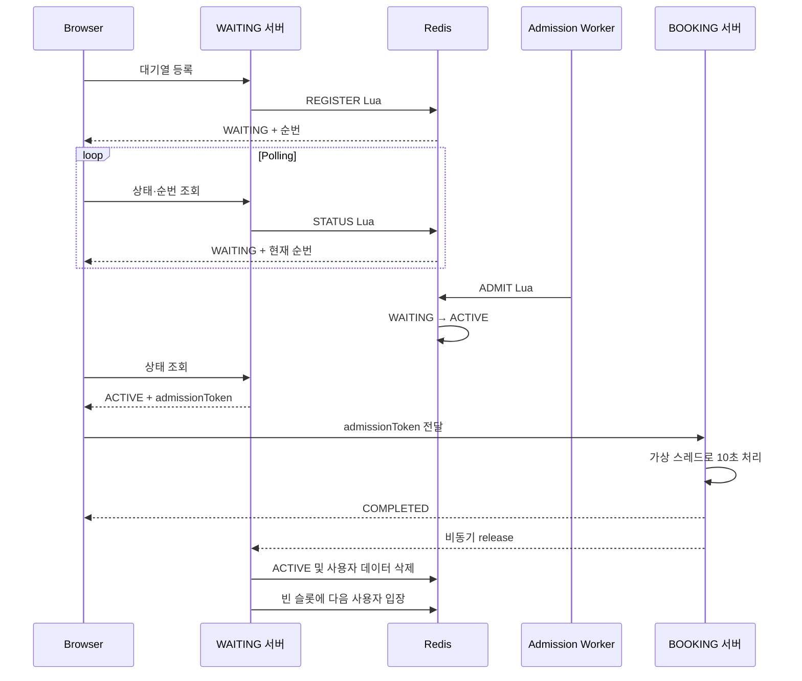

# Waiting Queue Flow

```mermaid
sequenceDiagram
    participant Browser
    participant Waiting as WAITING 서버
    participant Redis
    participant Worker as Admission Worker
    participant Booking as BOOKING 서버

    Browser->>Waiting: 대기열 등록
    Waiting->>Redis: REGISTER Lua
    Redis-->>Browser: WAITING + 순번

    loop Polling
        Browser->>Waiting: 상태·순번 조회
        Waiting->>Redis: STATUS Lua
        Redis-->>Browser: WAITING + 현재 순번
    end

    Worker->>Redis: ADMIT Lua
    Redis->>Redis: WAITING → ACTIVE

    Browser->>Waiting: 상태 조회
    Waiting-->>Browser: ACTIVE + admissionToken

    Browser->>Booking: admissionToken 전달
    Booking->>Booking: 가상 스레드로 10초 처리
    Booking-->>Browser: COMPLETED

    Booking-->>Waiting: 비동기 release
    Waiting->>Redis: ACTIVE 및 사용자 데이터 삭제
    Waiting->>Redis: 빈 슬롯에 다음 사용자 입장
```
