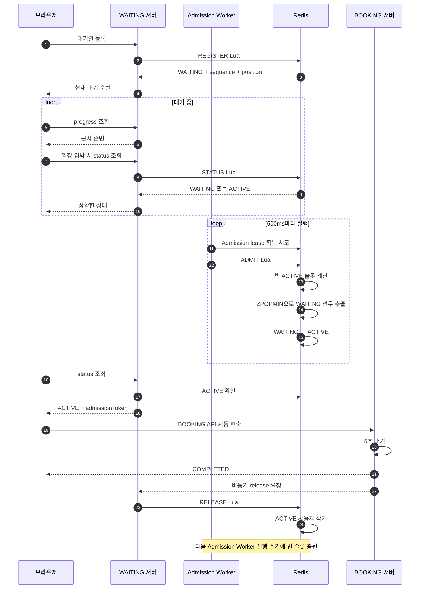

# Redis Ticket Waiting Queue

티켓 예매 서버가 처리할 수 있는 범위 안에서만 사용자를 입장시키기 위한 Redis 기반 대기열이다.

이 프로젝트에서는 대기 순서, 입장 상태, 입장 인원 제한만 다룬다. 실제 좌석 선택, 결제, 티켓 정합성은 구현하지 않으며 BOOKING 서버는 요청을 받은 뒤 5초 후 완료되는 테스트 시나리오로 동작한다.

## 1. 다이어그램

## 2. 기술 선택

### Redis

사용자가 자신의 현재 순번을 반복해서 확인해야 하고, WAITING과 ACTIVE 상태도 계속 변경된다.

Redis Sorted Set은 sequence를 score로 사용하여 FIFO 순서를 유지할 수 있다. 사용자의 현재 순번은 `ZRANK`로 확인할 수 있고, 대기열 앞쪽 사용자는 `ZPOPMIN`으로 추출할 수 있다.

Redis Lua 스크립트를 사용하면 전반적인 대기열 작업을 하나의 원자적 작업으로 처리할 수 있다.

Kafka는 이벤트 전달과 재처리에 적합하지만 사용자의 현재 순번이나 ACTIVE 여부를 즉시 조회하기는 어렵다. 다만 메시지 유실 측면에서 Kafka에 메시지를 보관하고, Consumer가 Redis에 `ZADD` 하는 아키텍처를 구상할 수 있다. 그렇다면 Kafka는 대기열이 아닌 메시지 보관 역할을 하게 된다.

### WebFlux

요청마다 플랫폼 스레드를 점유하지 않도록 Spring WebFlux와 Reactive Redis를 사용한다. 대용량 트래픽에서는 Thread Per Request 모델보다 요청을 효율적으로 처리할 수 있다.

## 3. 대기열 동작

(실제로 테스트를 시작하기 전에 이벤트 생성 API를 한 번 호출해야 합니다.)

### 3.1 대기열 등록

- 이벤트가 존재하는지 확인
- 이미 ACTIVE인지 확인하고, ACTIVE라면 마지막 접근 시각 갱신
- 이벤트가 `OPEN` 상태인지 확인
- 기존 WAITING 등록이 있으면 제거
- 대기열 상한 확인
- `nextSequence` 증가 및 sequence 발급
- WAITING ZSET에 `sequence`, `userId` 저장
- `waiting-last-seen`에 현재 접근 시각 저장
- `ZRANK`로 현재 순번 계산 후 반환

### 3.2 입장열 입장

Admission Worker가 **500ms**마다 실행되며 한 번에 최대 50명을 ACTIVE로 이동시킨다. 입장 수는 실제로 성능 지표에 따라 설정해야 하며, 필요하다면 스케줄링 횟수를 늘려 평탄화할 수 있다.

- 이벤트별 Admission lease 획득 → 분산 서버에서 Worker의 동시 실행 방지
- 이벤트가 입장 가능한 상태인지 확인
- 현재 ACTIVE 인원 조회
- `ACTIVE 상한 - 현재 ACTIVE 인원`으로 빈 슬롯 계산
  - 빈 슬롯과 배치 크기 중 작은 값을 입장 인원으로 결정
- `ZPOPMIN`으로 WAITING 선두 사용자 추출
- 추출한 사용자를 `waiting-last-seen`에서 삭제
- ACTIVE ZSET에 `마지막 접근 시각`, `userId` 저장
- `meta.lastAdmittedSequence` 갱신
- 입장 인원 반환

## 4. 마주한 문제

### 대기열 상태 polling 부하

모든 사용자가 개인 status API를 반복 호출하면 요청마다 Redis에서 `ZRANK`를 실행해야 한다. 대기 인원이 증가할수록 WAITING 서버와 Redis 부하도 함께 증가한다. 이를 줄이기 위해 이벤트 공통 progress API를 제공한다. WAITING 서버는 Redis의 `lastAdmittedSequence`(마지막 입장 순번)를 조회하고 3초 동안 캐싱한다.

브라우저는 자신의 sequence와 `lastAdmittedSequence`를 비교하여 근사 순번을 계산한다. 순번이 먼 사용자는 공통 progress만 조회하고 입장이 가까워졌을 때 개인 status를 조회한다. **근사 순번을 사용해도 괜찮다고 생각한 이유**는 아래와 같다.

- 대기열의 순번은 정확하지 않아도 된다. 실제 순번 입장은 Redis 내에서 정확하게 이루어진다.
- 엄격한 순번 표시 유지와 성능 최적화 중 후자의 이득이 높다. 순번이 엄격하게 표시되어야 한다면 근사 순번을 사용하면 안 된다.

또한 polling에는 **jitter**를 적용하여 여러 브라우저의 요청이 같은 순간에 몰리는 현상을 줄인다.

### 대기열, 입장열 등록 정합성

Redis는 하나의 Lua 스크립트를 실행하는 동안 다른 명령을 중간에 실행하지 않으므로 등록 과정의 원자성을 보장할 수 있다.

### 분산 Worker 중복 실행

WAITING 서버가 여러 대이면 각 서버의 Admission Worker가 동시에 실행될 수 있다. Lua 스크립트는 Redis에서 순차적으로 실행되지만 여러 Worker가 연속해서 ADMIT을 실행하면 비효율이 발생한다. 따라서 이벤트별 **분산 lease**(분산 lock)를 사용하여 해당 시점에 하나의 Worker만 입장을 처리하도록 했다. lease를 획득한 Worker만 ADMIT Lua를 실행한다.

### 입장 속도 평탄화

사용자를 한꺼번에 ACTIVE로 이동시키면 브라우저가 ACTIVE를 확인한 시점에 BOOKING 요청도 한꺼번에 발생할 수 있다. 만약 초당 100명의 입장을 원한다면 스케줄링 주기를 100ms, 배치 크기를 10명으로 설정해 입장 시점을 평탄화할 수 있다.

### 접속을 종료한 사용자 정리

브라우저가 닫혔는지를 WAITING 서버가 즉시 정확하게 판단할 수는 없다. WAITING 사용자가 status를 조회할 때 마지막 접근 시각을 기록한다. 일정 시간 동안 조회가 없다면 대기열을 이탈한 것으로 판단하고 WAITING과 `waiting-last-seen`에서 함께 제거한다. 현재 구현에서 입장열은 단순히 5초 뒤 종료되지만, 실제 티켓 예매라면 아무 작업도 하지 않는 사용자나 이탈한 사용자를 어떻게 처리할지 별도로 고려해야 한다.
